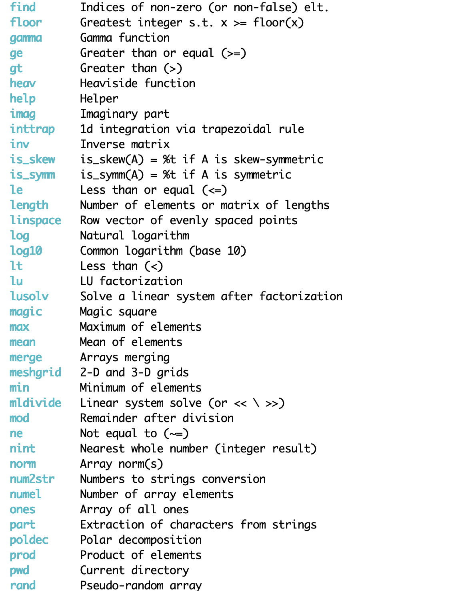

# Calmat: a Fortran Equation Parser Involving Matrix Operations


1. [What is Calmat](#whatis)

2. [Installation / Compilation](#comp)   
   2.1. [Compiling the pk2 library and calmat library and executable](#complib)  
   2.2. [Compiling your program that uses calmat](#compprog)  

3. [Calmat as a stand-alone program](#calmat1)  
   3.1. [Interactive mode](#calmat1a)  
   3.2. [Batch mode](#calmat1b)  
   3.3. [How to add user functions?](#functions) 
   
4. [Calling calmat from a user code](#calmat2)  
   4.1. [`exprIn` and `fileIn` arguments](#exprIn)  
   4.2  [The `stat` argument (error handling)](#stat)  
   4.3  [`warning`, `dispRes` and `welcome` arguments](#warn)  
   4.4  [`parseOnly` and `evaluate` arguments](#parseonly)  
   4.5  [Accessing the values of a calmat variable (copy, move allocation and pointer association)](#acces)
   
5. [The calmat default file (`.calmatdefaults`)](#calmatdef)

6. [Acknowledgements](#Acknowledgement)

7. [Examples](#examples)  
   7.1. [Example of script](#ex1)  
   7.2. [Example of user program](#ex2)
 
8. [TODO](#todo)

## 1.  What is calmat? <a name="whatis"></a>

Calmat can evaluate an expression or a set of expressions involving operations between matrices, vectors or scalars of any type (integer, real, complex, logical or character string), using a language borrowed from Matlab/Scilab (including two control structures: for loop and if-then-elseif constructs).  

Calmat is an application of the pk2 library (*polymorphic rank-2 arrays*, [see here](pk2/README.md)) that lets you define a variable that can represent a matrix of any type and perform almost any kind of operation.

Calmat is a **stand-alone program** [(see §3)](#calmat1) as well as a **subroutine** that can be called from a user program [(see §4)](#calmat2), for example:

```fortran
call calmat ( exprIn = "x = sqrt(5)-1 ; y = exp(-x^2)/x" )
```

```fortran
call calmat ( exprIn = "inv([1,2,3; 0,5,6; 7,8,9])" )

```


## 2. Installation / Compilation <a name="comp"></a>
Clone the calmat project:

```
git clone https://github.com/hassaniriad/calmat.git
```
It contains a copy of the pk2 project.

### 2.1. Compiling the `pk2` library and `calmat` library and executable <a name="complib"></a>

+ **Prerequisites**:  You will need a recent fortran compiler. At present, the compilers I have tested are:  
	- on macos: gfortran (>= 14), nagfor (>= Build 7213), ifort 2021.7.0
	- on linux: gfortran (>= 11.2.1), ifx (>= 2024.1.2)  
	
	(please note that several compiler bugs have been corrected, be sure you have the last release).

	I haven't tried compiling it on Windows and on macOS ARM, but if you do, I'd be very interested to know.

The makefile in the main `calmat` directory first runs the makefile of the `pk2` library (located in `calmat/pk2/src` directory) and then the makefile of calmat (located in `calmat/src` directory). These makefiles are ready to use for ifort, ifx, gfortran and nagfor (you can easily adapt them to another compiler).

   To get help just type: `make`  

+ **Setting the compiler name:** For compiling with ifort, gfortran or nagfor use the keyword `comp`, e.g.

```
         make comp=gfortran
```
+ **Setting options:** By default the flag `-O3` is used. You can use your own options by using the keyword `opt` whose value is a string. For example:

```
         make  comp=ifort  opt="-fast"
```
+ **Setting the kind parameters:** By default the kind parameters for integer (`Ikind`) and for real/complex (`Rkind`) are set, respectively, to `int32` and to `real64` (two parameters of the `iso_fortran_env` module).  
If you wish to change them use the keyword `kind` which can take the flags: `-DI32`, `-DI64`, `-DSP` or `-DDP` (for `int32`, `int64`, `real32`, `real64`, respectively). For example:
 
```
         make  comp=gfortran  kind="-DSP -DI32"
```  

If the compilation is successful 
 
- the `pk2` library (`libpk2.a` and `libpk2_d.so`) and the module files are located in `calmat/pk2/lib/$comp` and `calmat/pk2/mod/$comp`, respectively, where `$comp` is the name of the compiler used.
- the `calmat` library (`libcalmat.a` and `libcalmat_d.so`) and the module files are located in `calmat/lib/$comp` and `calmat/mod/$comp`, respectively.  
- the `calmat` executable (`calmat.exe` and `calmat_d.exe`) is located in `calmat/bin/$comp`

You can move them to a more appropriate directory if you wish or add their paths to your `LIBRARY_PATH`/`DYLD_LIBRARY_PATH` environment variable.


### 2.2. Compiling your program that uses `calmat` <a name="compprog"></a>
You need to link your program against `calmat`, `pk2`, `lapack`and `blas` libraries and to add the path name of the module files of `calmat` and `pk2` (`-I` flag). 

+ **If the static libraries are used**, the compilation takes the form:

```
   ifort -L$libcal -lcalmat -L$libpk2 -lpk2 -llapack -lblas -I $modcal  -I $modpk2 -o foo foo.f90
```
where`$libcal`, `$libpk2`, `$modcal` and `$modpk2` are the paths of the `calmat` and `pk2` libraries and module files.  

It may be shortened to:

```
   ifort -lcalmat -lpk2 -llapack -lblas -o foo foo.f90
```   
by setting the environment variable `LIBRARY_PATH`:

```
   export LIBRARY_PATH=/Users/me/calmat/pk2/lib/ifort:/Users/me/calmat/lib/ifort:$LIBRARY_PATH
```
and `CPATH` for module files (unfortunately, only ifort supports this):

```
    export CPATH=/Users/me/calmat/pk2/mod/ifort:/Users/me/calmat/mod/ifort
```
+ **If the shared libraries are used**, the compilation takes the form:

```
   gfortran -lcalmat_d -lpk2_d -llapack -lblas -I $modcal -I $modpk2 -o foo foo.f90
```   

provided that the environment variable `DYLD_LIBRARY_PATH` has also been set to:

```
   export DYLD_LIBRARY_PATH =/Users/me/calmat/pk2/lib/gfortran:/Users/me/calmat/lib/gfortran:$DYLD_LIBRARY_PATH
```

## 3. Calmat as a stand-alone program <a name="calmat1"></a>
Calmat can be executed in a window command, in interactive mode or in batch mode. To see the command line options type

```
    $ calmat -h
```

### 3.1. Interactive mode <a name="calmat1a"></a>  
Note: If you have `rlwrap` installed ([https://github.com/hanslub42/rlwrap](https://github.com/hanslub42/rlwrap)), you can use it to benefit from the left/right/up/down keys to recall a command (history) or to modify one, by launching:

    
```
        $ rlwrap calmat
```
or better (use an alias for convenience):
    
```
        $ rlwrap -c w 0 calmat
```
(`-c` allows file name completion).

Once calmat is running a prompt is displayed and it waits for an input. Enter your statements as in Matlab:

<p align="left">
      
</p>

<p align="left">
      
</p>

<p align="left">
      
</p>

<p align="left">
      
</p>

<p align="left">
      
</p>

+ **Available functions, operators and commands**: to list them type, respectively, `list fun`, `list op` and `list cmd`:

	<p align="left">
      
      
      
	</p>   
    	
   
	<p align="left">
      
	</p>   
    
	<p align="left">
      
	</p>   

	(see also the help of `list`)

+ **Help**: to get the help of a given command, a given function or a given operator use the command `help`, for example:

    <p align="left">
      
    </p>
+ **Comments**: as in scilab, the symbol `//` is used for comment.  

+ **Strings**: simple quotes or double quotes can be used for character strings.  

+ **List of variables (workspace)**: to list all your variables just type `list`:

    <p align="left">
      
    </p>

+ **Protected variables**: I have adopted the scilab convention for a predefined (and protected) variable: its name starts with a `%` (like `%pi`, `%i`, `%eps`, ...). You can define your own protected variable by using the command `set` (see the help of `set`).

+ **Deleting variables**: the variables (except the protected ones) can be deleted by the command `clear` (delete all variables). To delete a given set of variables, say `A` and `B`, use the command `clear A B` (without commas between variables).

+ **Executing a script**: you can write your calmat program in a text file and execute it by using the calmat command `exec` (as in scilab), for example

    <p align="left">
      
    </p>

	will execute the set of calmat instructions present in the file "laplacian2d".

    **Remark**: when the `exec` command is used or when an expression contains several statements (separated by commas or semicolons) the entire "stream" of statements is first parsed before any evaluation. If an error is detected during this parsing phase no evaluation will be performed even for statements preceding this error. Example:

    <p align="left">
      
    </p>

    The behaviour is obviously different when a runtime error occurs:

    <p align="left">
      
    </p>

+ **Control structures**: there are only two control structures: `if` and `for` constructs. A notable difference with Matlab/Scilab is that these blocks construct end with the keywords `endif` (or `end if`) and `endfor` (or `end for`), respectively. I find that it enhances the readability of a program. Moreover, the keyword `then`is always required in an `if` statement or an `if-elseif-else` construct (non-existent with Matlab and optional with scilab). Example:

    <p align="left">
      
    </p>

    (note that, as a reminder, calmat adapts its prompt by putting in square brackets the name of next the block structure to be closed).  

+ **Plotting**: I didn't spend much time on this point, but it deserves to be explored further. For the moment, the `plot`, `plot3d` and `surf` commands simply use gnuplot in a very basic mode.  

    <p align="left">
      
    </p>

### 3.2. Batch mode <a name="calmat1b"></a>
You can ask calmat to execute the commands of a given script, say 'my_script', in batch mode:
    
```
        $ calmat -i my_script -o my_results -b &
```

If the output file is not specified (with the `-o` option) the outputs will be written into a file named 'my_script.out'.

If the `-b` is not used, calmat will execute the script and then remain in interactive mode.


### 3.3. How to add user functions? <a name="functions"></a>
For the moment, it is not possible to define functions that can be interpreted on the fly (in interactive mode), as is the case with Matlab/Scilab with the keywords `function`/`endfunction`. 

It is possible, however, to define in a calmat script Fortran functions that will be compiled and added to the pk2 function library. The syntax for declaring a function follows that of Scilab, except for the use of the keywords `fortranproc` and `endfortranproc` in place of `function` and
`endfunction`: the output arguments are specified between square brackets (not
needed if only one ouput argument) and the input arguments are between 
parentheses after the name of the function:

```matlab
$ cat my_calmat_script

fortranproc [ out1, out2, ... ] = function_name ( in1, int2, in3, ... )
// Fortran code:
// declaration of input/output arguments (if any)
...
// declaration of local variables (if any)
...
// body of the function
endfortranproc function_name

fortranproc [ ... ] = an_other_function ( ...)
...
endfortranproc an_other_function

```

Remarks:

+ The script can contain any number of functions. 
+ The body of the function is given in very basic Fortran langage as illustrated in the examples given below.
+ The accepted types (don't worry about their kind, they'll be added automatically) for input/output arguments are: `integer`, `real`, `complexe`, `logical` and `type(str_t)` for string (don't use `character` except for local variables).
+ At present, output array argument must have an explicit shape (e.g. `y(3,2)`) or must be an allocatable.
+ The only way to run this script is to invoke calmat with the `-i` option:

```
$ calmat -i my_calmat_script
```
This command first checks whether there are any functions defined in the script, and if so, compiles and adds them to the pk2 library, then executes the script instructions (if any).


Example 1:

```fortran
$ cat myfun.txt 

// A function with 0 input and 0 output argument:

fortranproc hello
   print*,'hello world!'
endfortranproc

// A function with 1 scalar input and 1 scalar output arguments:

fortranproc y = foo0(x)
   real :: x, y
   y = x**2 + 2*x + 1
endfortranproc

// A function with a rank 1 input and an allocatable rank 1 output arguments:

fortranproc y = foo1(x)
   real              :: x(:)
   real, allocatable :: y(:)

   if ( allocated(y) ) then
      if ( size(y) /= size(x) ) deallocate(y)
   end if

   if ( .not. allocated(y) ) allocate(y, mold=x)
   y = (x-1)*(x-3)
endfortranproc

// A function with 3 inputs and 2 outputs (a scalar x + a matrix M):

fortranproc [ x, M ] = foo2 ( vec, b, c )
   real :: vec(3), b, c ! inputs
   real :: x, M(2,2) ! outputs

   real :: s, p ! locals

   s = vec(1)+b+c ; p = vec(2)*b*c
   x = s + 3*p
   M(1,:) = [ sin(x) / ( s + 1.23 ), cos(x) ]
   M(2,:) = [ exp(M(1,1)) , M(1,1)+M(1,2) ]
endfortranproc foo2

// Others:

fortranproc [ regular, x, detA, invA ] = solve3x3 ( A, b )
   real    :: A(3,3), b(3), x(3), invA(3,3), detA
   logical :: regular
!----------------------------------------------------------------------------------- 
! Solves the 3x3 linear system A*x = b using 3 cross products and 1 dot product
! Returns regular = .false. if the matrix is singular
! Computes also (if A is not singular) the inverse matrix
! Sets an error message and returns if A is singular
!----------------------------------------------------------------------------------- 

!- local variables -----------------------------------------------------------------
   real, parameter :: TOLDET = 1e-10
!----------------------------------------------------------------------------------- 
   regular = .true.
   invA(:,1) = cross ( A(2,:), A(3,:) )
   detA = dot ( invA(:,1), A(1,:) )
   if ( abs(detA) <= TOLDET * maxval(abs(A)) ) then
      regular = .false.
      opflag = err_t(stat=UERROR,where='solve3x3b',msg=&
                    'could not solve the system, the matrix is singular or near singular')
      return
   end if
   invA(:,1) = invA(:,1) / detA
   invA(:,2) = cross ( A(3,:), A(1,:) ) / detA
   invA(:,3) = cross ( A(1,:), A(2,:) ) / detA
   x = b(1)*invA(:,1) + b(2)*invA(:,2) + b(3)*invA(:,3)
   
   contains 
!
!-   internal functions of solve3x3:
!
     function cross ( x, y ) result(z)
       real, intent(in) :: x(3), y(3)
       real             :: z(3)
       z(1) = x(2)*y(3) - x(3)*y(2)
       z(2) =-x(1)*y(3) + x(3)*y(1)
       z(3) = x(1)*y(2) - x(2)*y(1)
     end function cross

     function dot ( x, y ) result(s)
       real, intent(in) :: x(3), y(3)
       real,            :: s
       s = x(1)*y(1) + x(2)*y(2) + x(3)*y(3)
     end function dot
endfortranproc solve3x3   
```
Then if we run calmat in interactive mode:

```
$ calmat -i myfun.txt
```
by entering `list fun` we can list all available functions, or by `list ufun` only the user's functions:

<p align="left">
      
</p>

and we can use them as any built-in functions:

<p align="left">
      
</p>


Example 2: a more concrete example

Considere the following calmat script containing only one user function

```matlab
$ cat newton2b

disp('<< Hello from newton2 >>')

clear

t0 = cputime();

fortranproc [ u, M ] = mysystem ( v )
   ! A 3x3 non-linear system u(v) = 0 
   ! u is the residual, M is the jacobian matrix, v is the variable
   
   real :: v(:) !< input
   real :: u(3), M(3,3) !< outputs
   
   real :: x, y, z !< local variables
   
   // The user can handle any errors via the “opflag” module variable:
   
   if ( size(v) < 3 ) then
      opflag = err_t ( stat = UERROR, where = 'mysystem', msg = &
                       'The size of the input array should be at least 3' )
      return
   end if

   x = v(1) ; y = v(2) ; z = v(3)

   u = [ real:: sin(x) + y**2 + log(z) - 7, &
                3*x    + 2*y  - z**3   + 1, &
                x      + y    + z      - 5 ]

   M(1,:) = [ real:: cos(x), 2*y, 1/z    ]
   M(2,:) = [ real:: 3     , 2  ,-3*z**2 ]
   M(3,:) = [ real:: 1     , 1  , 1      ]

endfortranproc mysystem

// Solve the system mysystem(x) = 0 with the Newton method:

nmax = 300 ; // max. number of iterations
eps_dX = 1e-8 ; eps_f = 1e-10 ; // increment and residual tolerances
kconv = 0 ;

X = [ 5 ; 5 ; 5 ] ; // the starting point

// Start Newton iterations:

for k = 1:nmax

   // call to user's function:

   [fX, JfX] = mysystem(X) ;

   // Compute the correction:

   dX = -JfX \ fX ;

   // New estimate of X:

   X = X + dX ;

   // Convergence criteria:

   if norm(dX) < eps_dX*norm(X) | norm(fX) < eps_f then
      kconv = k ;
      break
   end if
   
end for

// Print the solution found:

if (kconv == 0) then
   disp('Warning: not converged in nmax = ' + num2str(nmax) + ' iterations.')
else
   disp('Converged in ' + num2str(kconv) + ' iterations.')
end if

disp(X,'Solution found: ')
disp(norm(fX),'Residual norm: ')

disp("cpu time: "+num2str(cputime()-t0))

disp('<< End newton2 >>')
```

We run this script in interactive mode:

```
calmat -i newton2b
```
which results in

<p align="left">
      
</p>

and as calmat has compiled our function `mysystem`we can use it if we wish, or we can even re-execute the script:

<p align="left">
      
</p>

Remarks: 

+ As the functions are compiled, there's no need to place them before they're invoked in the script. Thus, in the previous example, the `mysystem` function could be freely placed at the end of the file for example.
+ Note the use of the error handler in the function `mysystem` (`opflag` is a module variable of pk2). 
+ Although not recommended (as it is potentially dangerous), a user function can have the same name of an existing build-in function. In that case, calmat use the user version.
+ Even more inadvisable: a user function can have the same name as a Fortran intrinsic function (e.g. `sin`). In this case, you'll need to use the `intrinsic` declaration whenever you need to use the intrinsic Fortran function. Example:

	```fortran   
	fortranproc bool = sin ( i )   
		logical :: bool
		integer :: i
		bool = ( i > 10 )
	fortranproc sin
	
	fortranproc y = foo ( x )
		real :: x, y
		intrinsic sin
		y = sin( x + 1 )
	fortranproc foo
	```

## 4. Calling calmat from a user code <a name="calmat2"></a>
Calmat is also a subroutine that you can call from your program. This subroutine has 8 optional arguments, the use of which is illustrated in the following sections.
### 4.1. `exprIn` and `fileIn` arguments<a name="exprIn"></a>
The subroutine `calmat` can be called in interactive mode or to evaluate a given expression or to evaluate a whole file as shown below:

```fortran
    program foo1
       use calmat_m
       implicit none

       ! This example illustrates the three ways of calling calmat

       ! 1) Calling calmat in interactive mode:
       !    (You will have to finish by typing 'exit' or 'quit' to exit the
       !    interactive mode and to allow the rest of the program to continue)

       call calmat ( )

       !...

       ! 2) Evaluating an expression:

       call calmat ( exprIn = "x=sqrt(5)-1; y=exp(x^2)/x")

       ! Note that you can call calmat as many times as you like.
       ! The variables created during the various calls are left
       ! stored in memory (unless a "clear" is done) and can
       ! therefore be reused:

       call calmat ( exprIn = "diag([ x, sin(y) ])-1")

       ! 3) Executing a script:

       call calmat ( fileIn = "myScript" )

    end program foo1
```
###### See also: `examples/user_programs/sample01_waysOfCallingCalmat.f90`

### 4.2. The `stat` argument (error handling)<a name="stat"></a>
Calmat uses an older version ([see here for the latest version](https://gitlab.oca.eu/hassani/err.git)) of the error handler `err`, a small module that defines a derived type named `err_t`, which facilitates the straightforward handling of error and warning notifications.

You can choose the behavior of calmat when an error occurs: stop just after reporting the error or delegate the decision to your program. This last alternative is activated by using the argument `stat` which is a variable of type `err_t`:

```fortran
    program foo2
       use calmat_m
       implicit none
       type(err_t) :: flag
       !...

       ! Caution:  if you use the stat argument, it will be your
       ! responsibility to check whether anything has gone wrong:

       call calmat ( fileIn = "myScript", stat = flag )

       if ( flag > 0 ) then
         ! An error has occurred: print the message and take a decision
         call flag%display() ! Prints the message and cleans flag
         !...
       end if
       !...
    end program foo2
```


### 4.3. `warning`, `dispRes` and `welcome` arguments<a name="warn"></a>
These are three (input) arguments of logical type.

+ `warning` controls the display of warning messages. Unlike error message, the display of a warning cannot be postponed to the caller and is, by default, immediately printed on the standard output.   
It can be ignored by setting `warning` to `.false.`.

+ `dispRes` controls the display of the result of an evaluation. By default, the result of an instruction that does not end with a semicolon is displayed on the standard output.   
Setting `dispRes` to `.false.` results in a silent evaluation.

+ `welcome` is used to print the banner and the welcome message of Calmat.

Note that it is not necessary to redefine these options each time calmat is called. In fact, if they are not redefined during subsequent calls, their last values will be reused.

+ Example

```fortran
   program foo3
      use calmat_m
      implicit none
      logical, parameter :: YES = .true., NO = .false.
      !...
      call calmat ( exprIn = "y=sin(%pi*(0:0.1:2))", &
                    dispRes = NO, & !< nothing displayed
                    warning = NO, & !< disable warning prints
                    welcome = NO  ) !< no welcome message
      !...

      ! If not redefined, the same options are used in subsequent calls:

      call calmat ( fileIn = 'laplaciand2d' )
      !...
   end program foo3
```


### 4.4. `parseOnly` and `evaluate` arguments<a name="parseonly"></a>
Parsing is time-consuming and there are situations where an expression needs to be evaluated more than once (in a loop, for example). In this case, it is more efficient to parse the expression first and then evaluate it as many times as required.


To do this, we first use the (output) optional argument `parseOnly` which is an integer identifying the "stream" of instructions passed to calmat (by `exprIn` or `fileIn`) and analyzed by calmat.

In the evaluation phase, we use the (input) optional argument `evaluate` assigning it the value corresponding to the analyzed stream:

```fortran
    program parseNeval
       use calmat_m
       implicit none
       integer :: fId
       !...

       ! Analyze phase: parse the instructions of "myScript"
       ! and store the result in a handle (# fId):

       call calmat ( fileIn = "myScript", parseOnly = fId )

       !...

       ! Evaluation phase:

       call calmat ( evaluate = fId )

    end program parseNeval
```
Note: You are not limited to a single stream. You can analyze as many as you want. You will just need to use the identifier of any of these streams to evaluate it.

###### See also: `examples/user_programs/sample05_parseThenEvaluate.f90` 
### 4.5.  Accessing the values of a calmat variable (copy, move allocation and pointer association)<a name="acces"></a>
Internally calmat uses a `pk2_t` array (named `G_vars`) to store all the variables involved in the user expression.  

The `pk2` module allows you to perform almost any kind of operation on `pk2_t` variables (usual operators and functions are overloaded). You can make copies or transfers between `pk2_t` variables and between `pk2_t` and intrinsics variables.  
However, if you don't want to learn how to use and manipulate such variables, calmat has a few routines for communicating with its internal list of variables and retrieving or modifying their values.


Here are the most important routines:

#### 4.5.1. `calmat_inquire`  
This subroutine checks if a given variable exists in the workspace (i.e. in `G_vars,` the internal list of calmat variables) and if so, it returns a variable of DT `ind_t` containing the following three members: 
 
- `%Id` (integer): the index in `G_vars` of the given variable (0 if not present)
- `%type` (character(1)): its type. May be 'e' (empty), 'i' (integer), 'r' (real), 'c' (complex), 'l' (logical) or 's' (string)
- `%size` (integer(2)): its dimensions, i.e. its number of rows and columns.

Example
 
```fortran
   type(ind_t) :: ix
   !...

   call calmat_inquire ( 'MyX', ix )

   if ( ix%Id == 0 ) then
      print*,'Unknown variable "MyX"'
      !...
   end if
```

#### 4.5.2. `calmat_copy`  
This generic subroutine is used to copy an intrinsic array of rank 0, 1 or 2 into a calmat variable and vice versa.  
There are two versions, depending on whether the variable is identified by its name or by its index.  
Moreover, an optional argument, `stat` (error handler), can be used to transfer responsibility for handling errors to the caller ([see section 4.2](#stat)).    
   
##### 4.5.2.1. Copy an intrinsic into a calmat variable (setter)  
In this direction there is only one constraint: the kind of assigned values must be int32 or int64 for integer type, real32 or real64 for real and complex types and of the default one for logical (we can also use the kind parameter `Ikind` for integer values and `Rkind` for real and complex values. These kind parameters are defined in the `pk2` library and can be chosen at compile time, [see section 2](#comp)).

Example:
   
```fortran
   program SetByCopy
      use calmat_m
      implicit none
      type(ind_t) :: ix
      ! user variables to set some calmat variables:
      real        :: r0, r1(3)
      integer     :: i2(4,5)

      !...

      ! set MyX to a real:
      ! (note: if the variable MyX does not exist, it will be created)
      call calmat_copy ( from = r0, to = 'MyX')

      !...

      ! set MyX to a rank 1 real array:
      call calmat_copy ( from = r1, to = 'MyX')

      !...

      ! set MyX to a rank 2 integer array:
      call calmat_copy ( from = i2, to = 'MyX')

      ! Same thing can be done using the variable index:
      call calmat_inquire ( 'MyX', ix )
      ! set MyX to a rank 2 integer array:
      if ( ix%Id /= 0 ) then
         call calmat_copy ( from = i2, to = ix )
      else
         !...
      end if

      !...

   end program SetByCopy
```
  
Notes:   
  
- Any attempt to modify a protected variable will result in an error.
- When a variable needs to be modified frequently (in a loop, for example), it is more efficient to use its index rather than its name (this avoids the overhead of locating the variable in the list).  
- When the calmat variable is identified by its name in the call to `calmat_copy`, i.e. when the actual argument `to` is a character, this variable doesn't need to exist in the workspace beforehand (in such case, it will be created).

##### 4.5.2.2. Copy a calmat variable into an intrinsic (getter) 
This subroutine is also used to get a copy of the data stored in a calmat variable (its matrix container) into a user array of intrinsic type. There are however a few constraints:  
  
- we obviously have to know its **type** (integer, real, complex, logical or of `str_t` type). An integer container can be copied into an integer, a real or a complex array. A real container can be copied into a real or a complex array.
- the copy must be **allocatable** and its **kind** has to be  `Ikind` for integer and `Rkind` for real or complex. These kind parameters are defined in the `pk2` library and can be chosen at compile time ([see section 2](#comp)).
- the **rank** of the copy must be 0, 1 or 2. If the rank is 0 (scalar) only the element (1,1) is copied. If the rank is 1 (vector) the copy is done in major column order.  

Example:
    
```fortran
    program GetByCopy
      use calmat_m
      implicit none
      ! user variables to get the result of a calmat evaluation:
      real(Rkind), allocatable :: r0, r2(:,:)
      type(str_t), allocatable :: s1(:)

     !...

     call calmat ( exprIn = 'x = rand(3,4); h = ["hello"," world","!"]')

     ! copy the first element of x into r0:
     call calmat_copy ( from = 'x', to = r0 )

     ! copy the matrix of x into r2:
     call calmat_copy ( from = 'x', to = r2)

     ! copy in vector form the matrix of h into s1:
     call calmat_copy ( from = 'h', to = s1)

     ! Same thing can be done using the variable index, e.g.:
     call calmat_inquire ( 'x', ix )
     call calmat_copy ( from = ix, to = r2 )

     !...

    end program GetByCopy
```

Note: if the calmat variable is empty the user array will be deallocated if allocated.

###### See also: `examples/user_programs/sample02_getAndSetByCopy.f90`  

#### 4.5.3.  `calmat_moveAlloc`
Rather than a copy, a faster way of exchanging data (when the rhs is no longer needed) is to use a transfer by move allocation.  
As for `calmat_copy`, there are two versions, depending on whether the variable name or its index is used. The optional argument, `stat` (error handler), can also be used to transfer responsibility for handling errors to the caller ([see section 4.2](#stat)).

##### 4.5.3.1. Move allocation from an intrinsic to a calmat variable (setter)  
The constraints on the intrinsic user variable are as follows:  
 
- it must be an **allocatable** array of **rank 2** (nevertheless, if its rank is 0 or 1, a copy will be used instead and the user array will be deallocated)
- for numeric types the **kind** parameter of the user variable must be `Ikind` (for integer) or `Rkind` (for real or complex)  

Example:
     
```fortran
     program SetByMoveAlloc
        use calmat_m
        implicit none
        ! user variables to set a calmat variable:
        real   (Rkind), allocatable :: r2(:,:)
        logical       , allocatable :: l2(:,:)
        integer(Ikind), allocatable :: i1(:)

        !...

        r2 = reshape([1.,2.,3.,4.],[2,2])
        l2 = reshape([.true.,.false.,.true.],[3,1])
        i1 = [1,2,3]
        !...

        call calmat ( exprIn = 'MyX = [], MyL = [], MyI = []' )

        !...

        ! move allocations:
        call calmat_moveAlloc ( from = r2, to = 'MyX' )
        call calmat_moveAlloc ( from = l2, to = 'MyL' )

        !...

        ! However, in the following a copy of i1 into MyI
        ! (a 3x1 matrix) is used followed by a deallocation of i1:
        call calmat_moveAlloc ( from = 'i1', to = 'MyI')

        !...
     end program SetByMoveAlloc
```
Note: when the calmat variable is identified by its name in the call to `calmat_moveAlloc` (as in the above example), i.e. when the actual argument `to` is a character, this variable doesn't need to exist in the workspace beforehand (in such case, it will be created).

##### 4.5.3.2. Move allocation from a calmat variable to an intrinsic (getter)
The same rules apply:  

- the user array must be an **allocatable** of **rank 2** (nevertheless, if the rank is 0 or 1, a copy will be used instead and the calmat variable will be deallocated)
- for numeric types the **kind** parameter of the user variable must be `Ikind` (for integer) or `Rkind` (for real or complex)

Example:
     
```fortran
   program GetByMoveAlloc
      use calmat_m
      implicit none
      ! user variables to get the result of a calmat evaluation:
      real   (Rkind), allocatable :: r2(:,:)
      logical       , allocatable :: l2(:,:)
      integer(Ikind), allocatable :: i1(:)

      !...  

      call calmat ( exprIn = 'MyX = rand(4,3); MyL = MyX > 0.5;' )

      !...

      ! move allocations:
      call calmat_moveAlloc ( from = 'MyX', to = r2 )
      call calmat_moveAlloc ( from = 'MyL', to = l2 )

      call calmat ( exprIn = 'MyI = magic(5)' )

      ! However, in the following a copy of MyI into i1 is used
      ! followed by a deallocation of the container of MyI:
      call calmat_moveAlloc ( from = 'MyI', to = i1 )

      !...

      ! Note: Variables "MyX", "MyL" and "MyI" are now empty
      ! but still present in the internal list of variables.

      !...

   end program GetByMoveAlloc
```

###### See also: `examples/user_programs/sample03_getAndSetByMoveAlloc.f90` 
 
#### 4.5.4. `calmat_getPointer`  

Another interesting way (avoiding deep copy) of accessing the container of a calmat variable is by pointer association.  
The generic subroutine `calmat_getPointer` takes the name of a calmat variable or its index and associates a user intrinsic pointer to the target variable container.  
The optional argument, `stat` (error handler), can be also used to transfer responsibility for handling errors to the caller ([see section 4.2](#stat)).  

The constraints are the following:

- we obviously need to know the **type** of the target variable. The **type** and **kind** of the pointer must match those of the target. Moreover, if the calmat variable is empty, an error will occur.
- The pointer can be of **rank** 0, 1 or 2. If the rank is 0 (scalar) the target value is the element (1,1) of the container. If the rank is 1, the target values are the elements of the container arranged in major column order.  
- Through the pointer, the values of the target variable can be changed, but this variable must not be resized (this would generate a runtime error).

Example:
  
```fortran
   program getPointer
      use calmat_m
      implicit none
      complex(Rkind), pointer :: zmat_ptr(:,:)

      ! A given expression with a complex result:
      call calmat ( exprIn='z=exp(-%i*rand(3,3)) \ [1:3;4:6;7:9]' )

      ! Pointer to the container of the result z:
      call calmat_getPointer ( var = 'z', ptr = zmat_ptr )

      ! Do what you have to do with the result (but make sure you don't resize it)
      call doSomeThing ( zmat_ptr )

      ! A new expression involving the values of z modified by doSomeThing:
      call calmat ( exprIn='z = z+eye(3,3)' )

      ! Don't forget to nullify the pointer when it's no longer needed:
      nullify(zmat_ptr)

      !...
   contains

      subroutine doSomeThing ( z )
         complex(Rkind), intent(in out) :: z(:,:)
         !...
         z = abs(z)
      end subroutine doSomeThing

   end program getPointer
```
###### See also: `examples/user_programs/sample04_getPointer.f90` 


## 5.  The calmat default file (`.calmatdefaults`) <a name="calmatdef"></a>
When `calmat` is run, it first looks for a file named `.calmatdefaults` on the working directory. If there is none, it looks for it in your home directory. Finally, if it doesn’t find it either, it creates one on your home directory. You can adapt this file to best suit your preferences. To recover the default settings, just remove this file and re-run `calmat`.
You can also make copies of this file in your working directories and make them specific to the intended applications.  

This file follows the calmat syntax (`calmat` interprets and evaluates its own default file).

At present, the content of this file is as follows (see the help of the calmat `set` command which allows to change a default property or to define a protected variable):

```matlab
// calmat user's settings

// prompt symbol: symbol used for the prompt:

   set(prompt,"(calmat) ~> ");

// user colors: (choose among k, r, g, b, y, m, c, w and append b for bold and h for high):

   set(color.prompt , "b_hb") ;
   set(color.help   , "c_b") ;
   set(color.error  , "r_b") ;
   set(color.warning, "g_b") ;
   set(color.title  , "c_b") ;
   set(color.normal  ,"b") ;

// messages: display welcome message (yes/no) and content of the farewell message:

   set(message.welcome , "no") ;
   set(message.farewell, "Thank you for using calmat. See you soon. Bye!") ;

// gnuplot: path of gnuplot (if not in your $PATH), valid terminal and font:

   set(gnuplot.path    , "gnuplot") ;
   set(gnuplot.terminal, "qt") ;
   set(gnuplot.font    , "Verdana, 12") ;

// max_display: number of digits and portion size to be displayed for large arrays:

   set(display.maxDigits , 8) ;
   set(display.portion , [10,10]) ;

// error_traceback: yes/no:

   set(error.traceback , "yes") ;

// you can define your own protected variables (name starting with %) e.g.:

   set( %gold , (sqrt(5)+1)/2 ) ;
```


## 6.  Acknowledgements <a name="Acknowledgement"></a>

I am very grateful to the developers of the following external modules and libraries that calmat uses:

+ **dispmodule**: *A Fortran 95 module for pretty-printing matrices* (https://dl.acm.org/doi/10.1145/1486525.1486531).  
    A very nice module that saved me a lot of time!

+ **f90getopt**: *Parsing command-line options and arguments*  (https://github.com/haniibrahim/f90getopt/tree/master).

+ **interpreter**: *An expression evaluator in Fortran* (https://github.com/ivomarb/Fortran-Expression-Evaluator).  
    Calmat doesn't use **interpreter** directly (**interpreter** is designed for scalar real variables) but I've followed its general algorithm, adapting and extending it to pk2_t variables in a module called pk2Interpreter integrated to my pk2 library.

+ **LAPACK**  
    Well-known library that need no introduction.  Almost all serious calmat linear algebra calculations depend on it.

+ **rlwrap**: *A 'readline wrapper', a small utility that uses the GNU Readline library to allow the editing of keyboard input for any command* (https://github.com/hanslub42/rlwrap).  
    Very useful when using calmat in interactive mode. It allows recalling a command or modifying an expression (via the left/right/up/down arrow keys).


## 7.  Examples <a name="examples"></a>
Here arre a simple calmat script and a user program. More examples of scripts and user programs can be found in the subdirectory `examples/` of calmat.

### 7.1. Example of script <a name="ex1"></a>

```matlab
// File lap2d: Example using calmat to solve the 2d Poisson problem:
//
//    find u: Omega --> R, s.t.
//    -laplacian(u) = f,    in Omega = ]a,b[^2
//     u            = g,    on dOmega
//
//    by finite differences method
//

// This script can be used in two ways:
//
// - in interactive mode: after launching calmat, type
//
//                 exec 'lap2d'
//
//  -in batch mode: in a terminal window, type
//
//              calmat -i lap2d -o out

   disp('<< Start laplacian2d >>')
   clear

   disp(...
        'Solve \n'                                             + ...
        '     | find u: Omega --> R, s.t. \n'                  + ...
        '     | -laplacian(u) = f in Omega = (0,1) x (0,1) \n' + ...
        '     |  u            = g on dOmega \n'                + ...
        'with the Finite Differences Method')


// Number of nodes, mesh size and nodes coordinates:

   a = 0 ; b = 1 ;
   n = 51 ; N = n^2 ; h = (b - a) / (n - 1) ; // uniforme mesh

   XY = meshgrid ((a:h:b)',(a:h:b)') ; // node coordinates

// Set the matrix K and the rhs (F = h^2 * f(x)) :

   sz = '(of size ' + num2str(N) + ' x ' + num2str(N) + ')' ;
   disp('Setting the matrix and the rhs of the system ' + sz)

   K = 4*diag(ones(N,1)) - diag(ones(N-1,1),-1) - diag(ones(N-1,1),1) ...
                         - diag(ones(N-n,1),-n) - diag(ones(N-n,1),n) ;

// Set the rhs (F = h^2 * f(x)) :

   x = XY(:,1) ; y = XY(:,2) ;

   A = 2*%pi ;
   B = 2*%pi ;
   F = h^2 * (A^2 + B^2) * sin(A*x) .* cos(B*y) ;

// Insert the boundary conditions:

   // boundary node #s:
   //   botom  right     top         left   
   i = [1:n  , 2*n:n:N,  N-n+1:N-1,  n+1:n:N-2*n+1] ;

   // Modify F:   
   F(i) = sin(A*x(i)) .* cos(B*y(i)) ;

   // Modify K:
   nbc = length(i) ; K(i,:) = 0 ; K(i,i) = eye(nbc,nbc) ;

// Solve the system K*U = F:

   disp('Solving the system -- Start') ; t1 = cputime();
   U = K \ F;
   disp(cputime()-t1,'Solving the system -- End. Total cpu time: ')

// Plot the numerical solution and the exact solution:

   disp('Plotting (call to gnuplot)')
   surf(x,y,U , x,y,sin(A*x).*cos(B*y),':', ...
       title = "Solution with f = (A^2 + B^2) sin(Ax) cos(By) and g = sin(Ax) cos(By)",14)

   disp('<< End laplacian2d >>')
```

   The result is reproduced below:

<p align="left">
   
</p>
<p align="left">
   
</p>

### 7.2. Example of a user program <a name="ex2"></a>


```fortran
program sample09_userExpression2
!-----------------------------------------------------------------------------------------------
!  In this example the user give:
!
!   - a literal element-wise expression involving the coordinates of mesh nodes (given in
!     a 2 x n array coord), for example: 
!                     f = sin( a * coord(1,:) ) .* cos ( b * coord(2,:) ) 
!     the result is then a 1 x n array
!
!   - any constants used in this expression (e.g. a and b)
!
!   - the node coordinates (coord) where to evaluate the expression
!
!  We use here a vectorial form (see sample08_userExpression1 for a slightly less efficient 
!  way using a do-loop)
!-----------------------------------------------------------------------------------------------
   use calmat_m
   implicit none
   logical, parameter              :: Yes = .true., No = .false.
   character(len=100)              :: userConstants="", userExpression=""
   real     ( Rkind ), allocatable :: coord(:,:), result(:,:)
   integer  ( Ikind )              :: inode, nNode, u, err
   real     ( Rkind )              :: t1, t2
!-----------------------------------------------------------------------------------------------

!
!- 1) Read the user data:
!  ======================
   
   print '(/,a)','Reading the user data in sample09.input'
   
   open(newunit=u, file='data/sample09.input', status='old', action='read', iostat=err) 
   if ( err /= 0 ) stop 'Unable to open the input file "data/sample09.input"'
   
   ! read the user expression: we assume this is a real element-wise expression of the two
   ! real variables coord(1,:) and coord(2,:) and that the result is noted f (a valid 
   ! expression is for example: f = 3*coord(1,:) + 2*coord(2,:))
   read(u,'(a)',iostat=err) userExpression
   
   ! if the user expression involves some constants define them (otherwise set an empty line), 
   ! for example, if f = a*coord(1,:) + b*coord(2,:), define a and b on the same line, e.g.: 
   ! a = 3 ; b = 2 
   if ( err == 0 ) read(u,'(a)',iostat=err) userConstants

   ! read the number of nodes:
   if ( err == 0 ) read(u,*,iostat=err) nNode
   if ( err == 0 ) allocate(coord(2,nNode))
   
   ! read the node coordinates:
   if ( err == 0 ) then
      do inode = 1, nNode
         read(u,*,iostat=err) coord(1,inode), coord(2,inode)
         if ( err > 0 ) exit
      end do
   end if
   
   if ( err /= 0 ) stop 'Error occured during the read'
   close(u)
   
   open(newunit=u, file='data/sample09.output', status='replace', action='write', iostat=err) 
   if ( err /= 0 ) stop 'Unable to open the output file "data/sample09.output"'

   call cpu_time(t1)
! 
!- 2) Initialize the user constants (if any):
!  ==========================================

   call calmat ( exprIn = trim(userConstants), warning = Yes, welcome = No, dispRes = No )   
!
!- 3) Create and set a new variable called 'coord' and evaluate the user expression:
!  =================================================================================

   call calmat_moveAlloc ( from = coord, to = 'coord' ) !< whenever possible, prefer to use
                                                        !< movealloc rather than a copy

   print '(/,a,i0,a)','Evaluate "'//trim(userExpression)//'" at ',nNode,' points'
   
   call calmat ( exprIn = trim(userExpression) )
!
!- 4) Get the result:
!  ==================

   call calmat_moveAlloc ( from = 'coord', to = coord  )
   call calmat_moveAlloc ( from = 'f'    , to = result )

   call cpu_time(t2)
   print*,'cpu time spent for evaluation: ',t2-t1

   ! use the result:
   ! ...
   ! write the result:
   do inode = 1, nNode
      write(u,*) coord(1,inode), coord(2,inode), result(1,inode)
   end do
   close(u)   

   print '(/,a)','Done. The result is printed in sample09.output'
   print '(a,/)','(You can draw the result with gnuplot for example)'
   
end program sample09_userExpression2
```
and here is an example of input file:

```
cat data/sample09.input

f = sin( a * coord(1,:) ) .* cos( b * coord(2,:) )
a = 2*%pi/20; b = 2*%pi/30;
60501
 0.0   0.0
 0.1   0.0
 0.2   0.0
 0.3   0.0
 0.4   0.0
 ...
 ...
19.8  30.0
19.9  30.0
20.0  30.0

```

## 8. TODO <a name="todo"></a>

- Extend `pk2` and `calmat` to sparse matrices
- Define a keyword `function` to allow functions to be defined on the fly  (ideas?)
